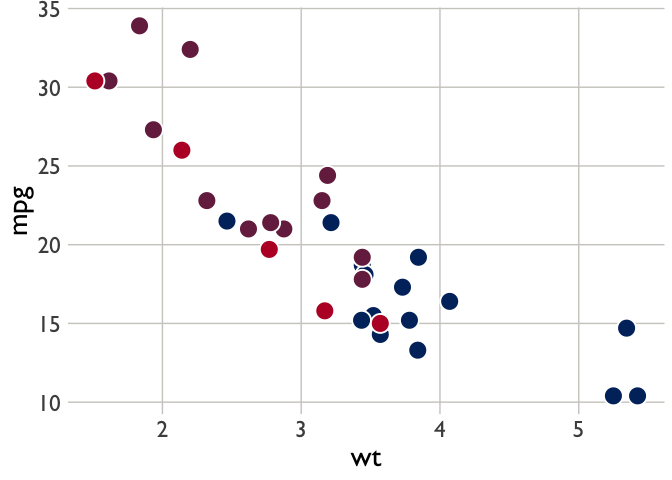
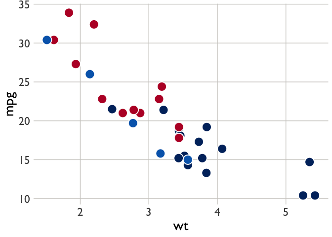
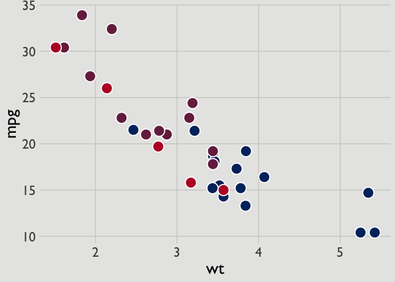

<!-- README.md is generated from README.Rmd. Please edit that file -->

# usaidplot

<!-- badges: start -->
<!-- badges: end -->

The goal of usaidplot is to apply USAID’s color palette to ggplot2
graphs. This package is based on the [USAID graphic standards
manual](https://www.usaid.gov/sites/default/files/2022-05/USAID_GSM-02_04_2020.pdf)
and inspired by the BBC’s plotting package,
[bbplot](https://github.com/bbc/bbplot). Special thanks to
[sheitin](https://github.com/sheitin) for helping get this thing off of
my computer and into the world.

## Installation

You can install the development version of usaidplot like so:

``` r
# install.packages("devtools")
devtools::install_github("jacobpstein/usaid_plot")
```

## Example Usage

One neat thing about this package is that you can apply the USAID color
palette to either discrete or continuous data without much effort.

Let’s look at a continuous example first using R’s mtcars data. We
specify `data_type="continous"` to apply USAID’s color palette to
continuous data.

``` r
library(usaidplot)
library(ggplot2)

ggplot(mtcars, aes(x = wt, y = mpg)) + 
  geom_point(aes(fill = gear), shape = 21, stroke = 1, col = "white", size = 6) + 
  usaid_plot(data_type = "continuous")
```



Now, let’s make the same plot, but apply discrete colors using
`data_type="discrete"`, which is also the default.

``` r

# we'll make gear a factor to change it from continous to discrete
ggplot(mtcars, aes(x = wt, y = mpg)) + 
  geom_point(aes(fill = factor(gear)), shape = 21, stroke = 1, col = "white", size = 6) + 
  usaid_plot(data_type = "discrete") # you can also just leave this blank
```



## Changing the background for presentations

USAID’s PowerPoint presentation
[template](https://www.usaid.gov/branding/resources) has a grey
background. In some cases, users may want to avoid the white-grey
contrast when they import figures into this template. Using the
`ppt=TRUE` option changes the background for all figures to match the
USAID slide template. The default is `ppt=FALSE`.

``` r
ggplot(mtcars, aes(x = wt, y = mpg)) + 
  geom_point(aes(fill = gear), shape = 21, stroke = 1, col = "white", size = 6) + 
  usaid_plot(data_type = "continuous", ppt = TRUE)
```



## Quiet font switching

USAID’s branding standards suggest Gill Sans as the default font for
all publications. However, users will find that Gill Sans MT is a
Windows font, whereas the Mac equivalent is Gill Sans. This package
quietly runs a `Sys.info()` function to determine what operating system
the user has and then changes the font accordingly to avoid generating
errors and to ease switching from one matchine to another.
